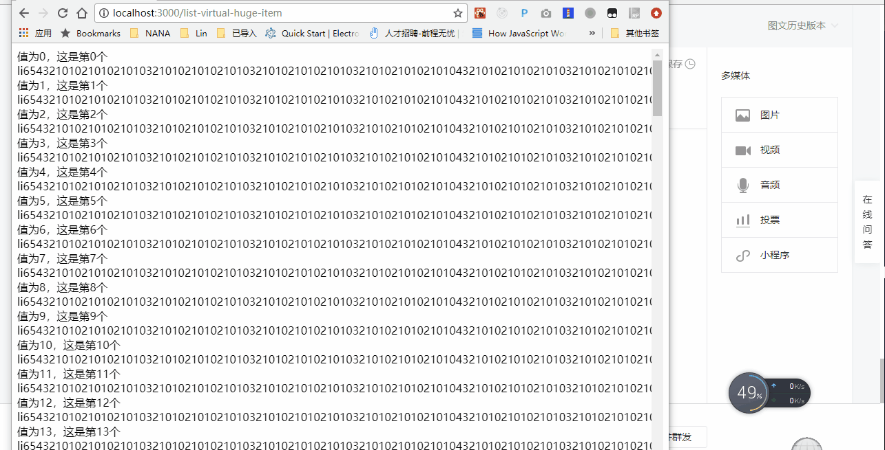

# react virtual list vs normal

## start

```
git clone https://github.com/postor/react-virtual-list-vs-normal.git
cd react-virtual-list-vs-normal
yarn
yarn dev
```

## scroll

http://localhost:3000/list-normal


http://localhost:3000/list-normal


## resize

http://localhost:3000/list-normal


http://localhost:3000/list-normal


## scroll with huge item

http://localhost:3000/list-normal-huge-item


http://localhost:3000/list-normal



